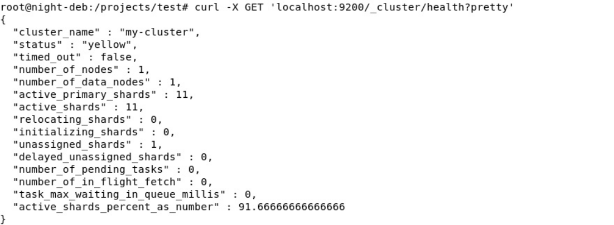
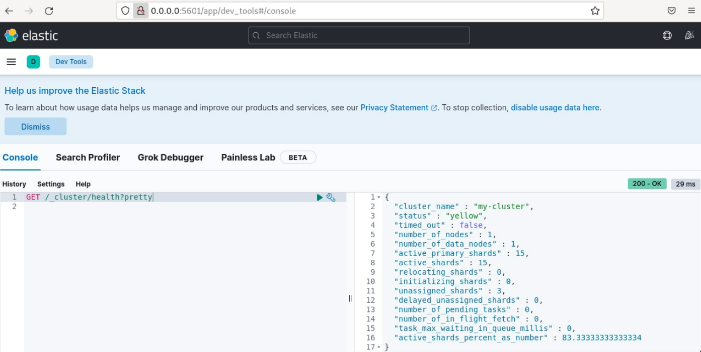

# Домашнее задание по теме "ELK" 

## Задание 1
Elasticsearch Установите и запустите Elasticsearch, после чего поменяйте параметр cluster_name на случайный.

Приведите скриншот команды 'curl -X GET 'localhost:9200/_cluster/health?pretty', сделанной на сервере с установленным Elasticsearch. Где будет виден нестандартный cluster_name.

Cluster_name передаётся в переменных окружения докер компоузом

    environment:  
      - xpack.security.enabled=false  
      - discovery.type=single-node  
      - cluster.name=my-cluster 

В докер компоуз добавлен мониторинг состояния эластика:

 healthcheck:  
      test: curl -s http://elasticsearch:9200/_cluster/health?pretty | grep -q -e 'green' -e 'yellow'  
      interval: 10s  
      timeout: 10s  
      retries: 50  

## Задание 2. Kibana

Установите и запустите Kibana.

Приведите скриншот интерфейса Kibana на странице http://<ip вашего сервера>:5601/app/dev_tools#/console, где будет выполнен запрос GET /_cluster/health?pretty.

В докер компоуз добавлен мониторинг доступности кибаны:

healthcheck:
 test: curl -s -I  http://kibana:5601/app/home | grep -q 'HTTP/1.1 200 OK'
 interval: 10s
 timeout: 10s
 retries: 50  

 
